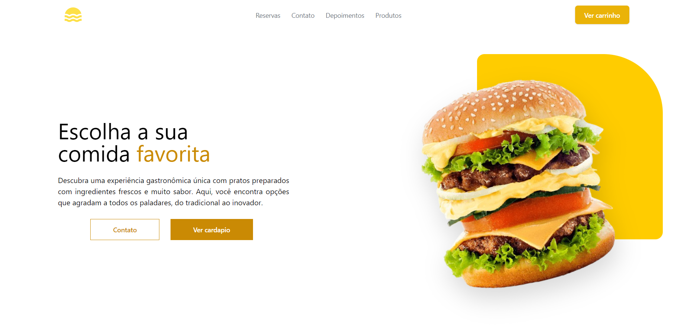

# Aplicativo de Restaurante

### Descrição

Este é um projeto de aplicativo para um restaurante fictício. O objetivo é simular a experiência de gerenciar e interagir com um restaurante, oferecendo funcionalidades como:

- Visualização de cardápios
- Gestão de pedidos e promoções
- Além de um sistema de reservas.

Atualmente, o aplicativo está quase completo, faltando apenas algumas funcionalidades que serão implementadas em breve.

## Tecnologias Utilizadas

Front-end: React, Typescript, Tailwind CSS para estilização responsiva e atraente.

Ferramentas de Design: SVGs para ícones e layout moderno baseado em componentes reutilizáveis.

## Funcionalidades

- Cardápio: Apresentação de pratos e bebidas com descrições e preços.

- Pedidos: Sistema para adicionar itens ao carrinho e realizar pedidos.

- Reservas: Possibilidade de reservar mesas diretamente pelo aplicativo.

- Contato: Uma seção interativa para informações de contato, incluindo e-mail, localização e telefone.

## Funcionalidades Futuras

- O uso do usecontext para gerenciar o carrinho de forma global e mais efetiva
- O uso do usecontext para gerenciar o tema de light e dark
- Usar api para conectar ao Whatsapp para finalização de pedido
- Arrumar a responsividade para mobiles
